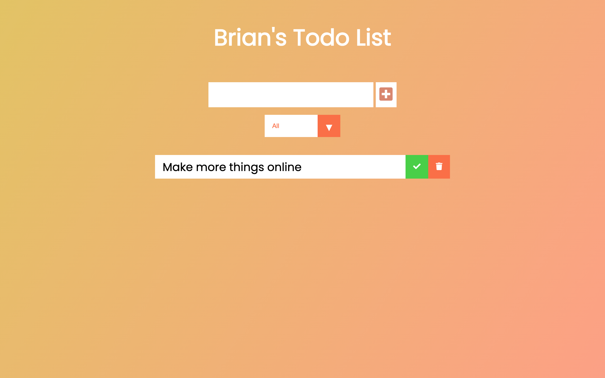

# Javascript TODO APP

This is a simple todo application implimenting local storage to create and read todo's in your browser.

## Table of contents

- [Overview](#overview)
- [The challenge](#the-challenge)
- [Screenshot](#screenshot)
- [Links](#links)
- [My process](#my-process)
- [Built with](#built-with)
- [What I learned](#what-i-learned)
- [Continued development](#continued-development)
- [Useful resources](#useful-resources)
- [Author](#author)

## Overview

### The challenge

The user should be able to:

- Add a todo item to the list and to local storage
- See a list of todo items
- Mark todo items complete
- Filter todo list by active and completed items
- Delete item from list and from local storage

### Screenshot



### Links

- GitHub URL: [https://github.com/brianlfarmerllc/Todo_App](https://github.com/brianlfarmerllc/Todo_App)
- Live Site URL: [https://local-storage-todo-app.netlify.app/](https://local-storage-todo-app.netlify.app/)

## My process

### Built with

- Semantic HTML5 markup
- CSS3 Styling
- Javascript
- Local Storage

### What I learned

This project was a practice in working with both javascript DOM manipulation and implementation of local storage to create, read, and delete list items.

```js
function saveLocal(todo) {
  // checking if todos exist in local storage
  let todos;
  if (localStorage.getItem("todos") === null) {
    todos = [];
  } else {
    todos = JSON.parse(localStorage.getItem("todos"));
  }
  // add new item to array
  todos.push(todo);
  // save new list to loacl storage
  localStorage.setItem("todos", JSON.stringify(todos));
}

function removeLocal(todo) {
  // checking if todos exist in local storage
  let todos;
  if (localStorage.getItem("todos") === null) {
    todos = [];
  } else {
    todos = JSON.parse(localStorage.getItem("todos"));
  }
  // remove deleted item from array
  todos.splice(todos.indexOf(todo), 1);
  // save new list to loacl storage
  localStorage.setItem("todos", JSON.stringify(todos));
}
```

### Continued development

There is a larger todo app chalange on frontend mentor that I want to complete and the basics of a todo app and local storage idea was something I needed to refresh my memory on.

### Useful resources

- [Local vs Session vs Cookies](https://krishankantsinghal.medium.com/local-storage-vs-session-storage-vs-cookie-22655ff75a8) - I enjoyed this artickle detailing the differences and best use cases of each.
- [MDN Local Storage](https://developer.mozilla.org/en-US/docs/Web/API/Window/localStorage) - Basics of local storage usage.

## Author

- Website - [Brian Farmer](https://brianlfarmerllc-biosite.netlify.app/)
- GitHub URL: - [GitHub URL](https://github.com/brianlfarmerllc)
